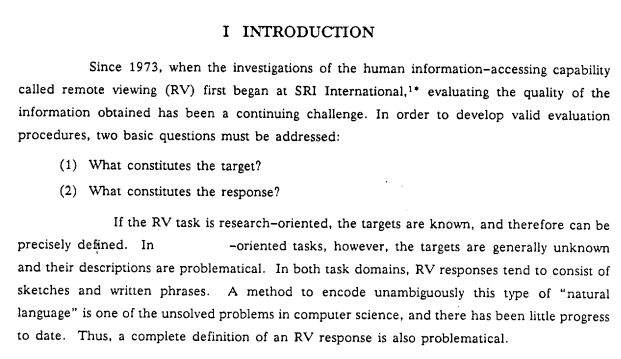

<div align="center">


</div>

<div align="center">
<a style="padding-left: 25px" href="https://idx.google.com/import?url=https%3A%2F%2Fgithub.com%2Fkurtismassey%2Fproject-stargate">
  
</a>
</div>&nbsp; 

<div style="padding-top: 25px; padding-bottom: 25px" align="center"></div>&nbsp; 

> [!NOTE]
> PROTOTYPE&nbsp; 

Project Stargate AI is an open source project based on the research work by the [Stanford Research Institute into Remote Viewing (RV)](https://www.newdualism.org/papers/H.Puthoff/CIA-Initiated%20Remote%20Viewing%20At%20Stanford%20Research%20Institute.htm), the practice of seeking impressions about a distant or unseen subject, beginning in the 1970s.&nbsp; 

<div align="center"></div>&nbsp; 

A key problem identified with the evaluation of remote viewing sessions is that the data is returned in the format of sketches and natural language. Proving to be a rather problematic to adequately run automated evaluation on, with early work done into fuzzy matching response data. The advancement of Large language models (LLMs) and more particularly multimodal large language models (MLLMs) (such as [*Google Gemini*](https://cloud.google.com/use-cases/multimodal-ai?hl=en#generate-text-code-video-audio-and-images-from-virtually-any-content-type)) means that we are now in an even better position to extract insight from these particular forms of data.&nbsp; 

Project Stargate AI is a working prototype built takes full advantage of the Google ecosystem having so far been developed entirely within [Project IDX](https://idx.google.com/) supercharged by [Gemini](https://cloud.google.com/products/gemini/code-assist?hl=en). Deployed on Google Cloud Run, utilising Firebase Authentication and Firestore for session storage and as a vectorstore for retrieval augmented generation (RAG) of session helper and training content. A custom initial version of a [Firestore Record Manager](https://github.com/googleapis/langchain-google-firestore-python/pull/90) for use with [langchain document indexing](https://python.langchain.com/v0.1/docs/modules/data_connection/indexing/) has been developed for taking full advantage of Firestore in the RAG process. An integration with [Imagen 2](https://deepmind.google/technologies/imagen-2/) a text-to-image model allows modelling of the viewers target based on data extracted from sketch and text based chats using the multi modal [Gemini 1.5 Pro](https://ai.google.dev/gemini-api) model. &nbsp; 

#### TO DO:
- Align session stages better with RV protocol
- Automate session routing and termination through AI Monitor barge
- Integrate Google Maps API *(Places API)* for Coordinate RV

## Getting Started

```bash
make start-web-app
```