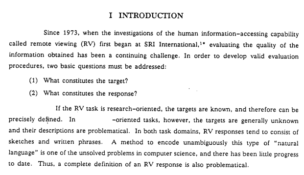
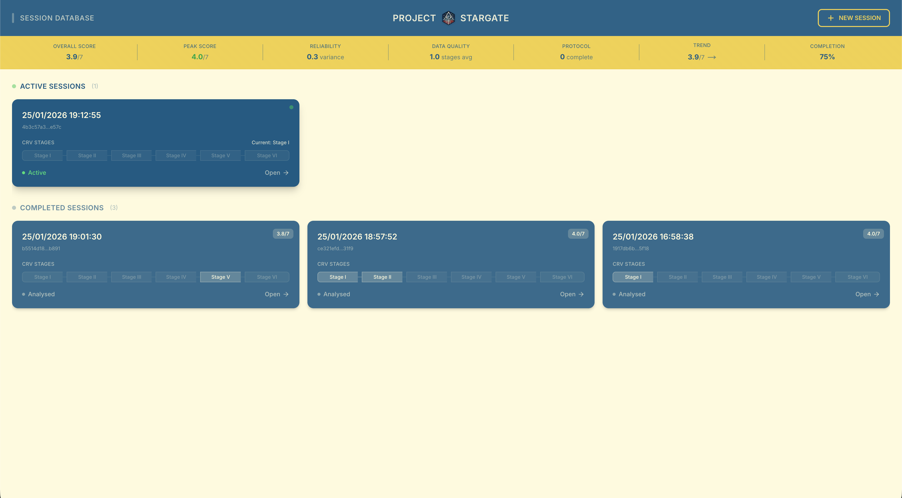
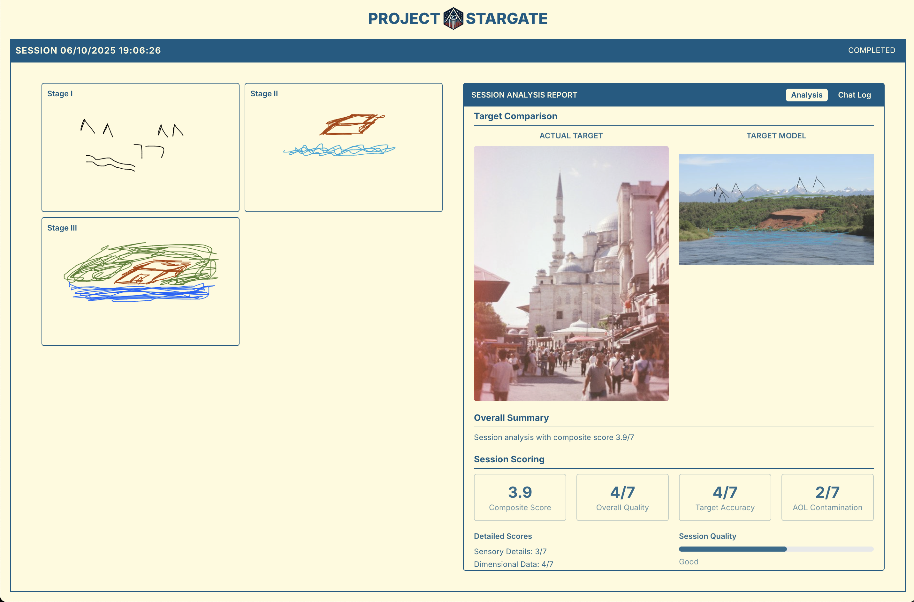

<div align="center">


</div>

<div align="center">
<a style="padding-left: 25px" href="https://idx.google.com/import?url=https%3A%2F%2Fgithub.com%2Fkurtismassey%2Fproject-stargate">
  
</a>
</div>&nbsp;

<div style="padding-top: 25px; padding-bottom: 25px" align="center"></div>&nbsp;

> [!NOTE]
> PROTOTYPE&nbsp;

Project Stargate AI is an open source project based on the research work by the [Stanford Research Institute into Remote Viewing (RV)](https://www.newdualism.org/papers/H.Puthoff/CIA-Initiated%20Remote%20Viewing%20At%20Stanford%20Research%20Institute.htm), the practice of seeking impressions about a distant or unseen subject, beginning in the 1970s.&nbsp;

<div align="center"></div>&nbsp;

A key problem identified with the evaluation of remote viewing sessions is that the data is returned in the format of sketches and natural language. Proving to be a rather problematic to adequately run automated evaluation on, with early work done into fuzzy matching response data. The advancement of Large language models (LLMs) and more particularly multimodal large language models (MLLMs) (such as [_Google Gemini_](https://cloud.google.com/use-cases/multimodal-ai?hl=en#generate-text-code-video-audio-and-images-from-virtually-any-content-type)) means that we are now in an even better position to extract insight from these particular forms of data.&nbsp;

<div align="center"></div>
<div align="center"></div>

#### TO DO:

- Integrate Google Maps API _(Places API)_ for Coordinate RV

## Getting Started

```bash
make dev
```

Populate your .env with the example.env variables
